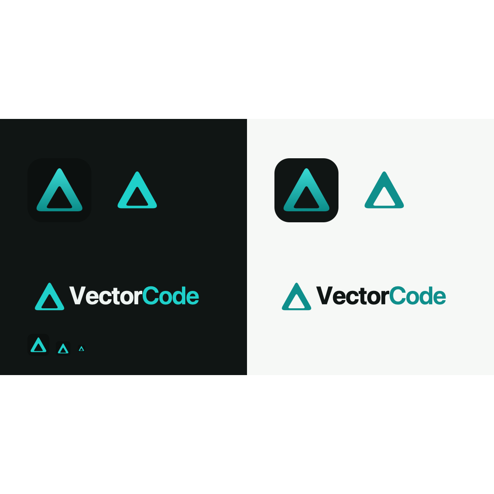

# VectorCode — brand mark

## Concept

A bold **delta** — the mathematical symbol for change and difference. It's what
VectorCode produces: measurable lift in how a company sees, decides, and ships.
Clean, geometric, technical; not a letterform, arrow, or node diagram. The
gradient gives it depth and a premium edge.

## Files

| File | Use |
|------|-----|
| `vectorcode-icon-dark.svg` | **Primary app icon** — gradient delta on the dark tile. |
| `vectorcode-mark.svg` | Standalone mark, flat teal — light backgrounds. |
| `vectorcode-mark-ondark.svg` | Standalone mark, flat bright teal — dark backgrounds. |
| `vectorcode-logo.svg` | Horizontal lockup (mark + wordmark), light. |
| `vectorcode-logo-ondark.svg` | Horizontal lockup, dark. |
| `preview.svg` / `.png` | This contact sheet. |

Favicon at `apps/web-api/public/favicon.svg` uses this mark.

## Palette

| Token | Hex | Use |
|-------|-----|-----|
| Teal (light bg) | `#0f8f8c` | Mark + "Graph" on light. Matches `design-tokens` `color.primary`. |
| Teal (dark bg) | `#1fd0ca` | Mark + "Graph" on dark. |
| Gradient | `#3ce0da → #0b8b88` | Icon depth. |
| Tile / ink | `#101514` | App-icon tile, "Vector" wordmark on light. |
| Wordmark on dark | `#eef4f2` | "Vector" on dark. |

## Wordmark

Inter — `Vector` 700, `Graph` 600, tracking −1.1. Outline the text before
distributing the lockup outside the app (the app already loads Inter).
