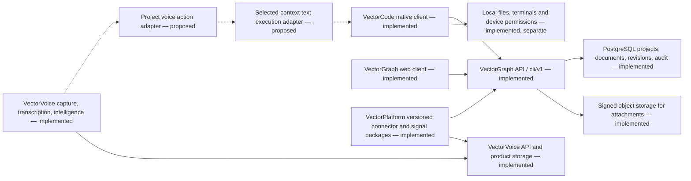

# Architecture decision: project document workflow across Vector products

Date: 2026-09-12. Status: product ownership accepted by owner direction;
first document slice implemented locally; execution and voice integration pending.
Authoritative product intent: [work application brief](work-application-brief.md).
Source evidence and unresolved gaps: [audit](work-application-audit.md).

## Decision

Keep four repositories with explicit, versioned API/package boundaries.
VectorGraph owns shared project/document records, workspace authorization,
relationships, durable revisions and product audit. VectorCode owns native
presentation, editor state, recoverable drafts and separately authorized local
execution. VectorVoice retains its meeting/capture/intelligence/delivery product
state and contributes reusable capability adapters where verified. VectorPlatform
owns demonstrated product-neutral contracts and mechanics, with product-independent
consumers and exact version pins. No common database, identity service, or universal
agent runtime is introduced.

Solid arrows describe implemented source boundaries, not verified live deployments.
Dashed arrows are proposed. Platform consumption by Graph/Voice is verified for
connector packages; the diagram does not assert adoption or deployment of Signals.
Document bodies and derived structured content live in Graph's document model;
attachment storage does not imply a generalized project file store already exists.

## Identity and capability separation

A Graph workspace UUID is the tenant boundary; teams constrain access within it.
A Graph project UUID is a work grouping and may link many documents and optional
repositories. A desktop work project has **zero-to-many local folder resources**;
each resource has its own URI and local access/trust boundary. Many folder bindings
may refer to the same Graph project. A Graph project ID, never the first folder URI,
is the shared work identity. Closing one folder must not delete the project, its
artifacts or other folder associations. An Electron/VS Code workspace and its local folders are client
execution resources, not tenants or authoritative project identities.

The client stores the selected Graph workspace/team/project in workspace-scoped
presentation storage. Optional folder associations use a profile-scoped machine
record keyed by that full tuple, independent of the first folder URI. A project
can retain an explicit empty list and closed folder references. Legacy bindings
for currently open folders are offered as the initial membership without rewriting
them; a saved empty list does not silently re-import removed folders.

The grouped **Show Work Project** picker exposes documents and associated folders.
Its document commands explicitly use the selected work project, including when an
unrelated local folder is active. Ordinary document commands preserve legacy
folder context unless that active folder belongs to the selected work project.
Folder membership changes invalidate pending document dialogs, alongside account,
project and binding changes, including switching away and back. Every server call
still enforces its own authorization.

This is a command-palette integration, not the completed persistent rail migration.
The legacy file/terminal/mobile model still identifies individual folder resources
by URI; this change neither passes Graph IDs to that model nor widens its access.
Choosing a listed folder delegates to the existing validated folder switcher only
if it is currently open. Managing associations does not open/close folders, read
files, change trust, terminate terminals, or delete artifacts. VC-60 rail integration
must preserve these boundaries and the user's per-folder editor/terminal state.

Graph owns global users and workspace memberships. Voice owns organization/user
records, WorkOS membership/FGA checks and session/device grants. Sharing WorkOS
does not prove shared subjects, audience, sessions, or authorization. Unified sign-in
and cross-product grants need an explicit account/workspace mapping and revocation
contract; no token interchange is introduced here.

## Optional assignment and moving captured work

Notes and transcripts have a stable artifact identity independent of project
membership. A recording may begin in the account's permitted capture scope with
no project; the desktop inbox presents unassigned items until the user files them.
Assignment state must not govern the lifetime of capture/transcription processing.
Changing a project neither restarts a job nor silently changes the context or
write destination of an in-flight document-generation action.

Graph's existing document create schema accepts an empty `links` array. Its update
schema accepts a links-only patch with expected revision and versioned save.
`artifact-document-mutations.ts` checks link access and performs the document CAS,
link replacement, and version insertion in one transaction. This supports keeping
one canonical note/document while changing its project relationships. A client
must preserve non-project links and all unrelated project links when moving one
association. The existing native parser only retains project IDs, so implementing
moves requires extending that contract before writing link replacements; it must
not reconstruct a partial link list and discard relationships.

The first move operation stays in the same tenant and preserves existing team
visibility. Clearing project membership must not clear team scope. Default the
inbox UI to the actual audience, not an unsupported claim of personal privacy.
The Voice service's current transcript remains tied to its meeting/upload record;
its Graph artifact association is a new integration contract, not permission to
copy transcript business rules or create a second authoritative transcript store.
Source recordings, transcript timestamps/speakers, and document revision history
must remain accessible through their original identities.

## First slice contracts and compatibility

Reuse existing `listApiProjects`, team/workspace discovery,
`listApiWorkspaceDocuments`, `getApiWorkspaceDocument`,
`createApiWorkspaceDocument`, and `updateApiWorkspaceDocument` through VectorCode's
existing main-process transport. Keep credentials out of renderer and artifact
content. Project selection adds no backend route or package change.

A document reference is `(workspace UUID, document UUID)` with a stable native
`vectorgraph-document` URI. Project linkage remains a Graph document relationship;
there is no second artifact table. Save sends the Markdown body,
`expectedRevisionNumber`, `expectedVersionNumber`, `saveMode: versioned`, and a
retained idempotency key. Graph currently prefers the revision precondition and
uses expected version only as a legacy fallback; these are not two independent
compare-and-swap checks. Keep that compatibility behavior explicit.

The native file model owns dirty buffers and hot-exit backups; the provider retains
the loaded revision and uncertain request identity. A conflict must keep the draft
and require deliberate comparison/reload before another write. Recovering prior
versions through native controls remains a gap; Graph/web already provide versions
and restore. Test this against the real file-model lifecycle before packaged
acceptance, not only provider reconstruction.

No coordinated client migration is necessary for the selection slice. Existing
web/CLI clients continue using their routes. Any new execution protocol must be
additive and versioned and reject unsupported versions without forcing package
upgrades across all products. Keep the Graph-owned API contract authoritative;
extract a Platform contract only after a second actual consumer exists.

## Next execution contract, not implemented

The smallest document action needs: schema version; workspace/project identity;
explicit selected document IDs and source revisions; target document and base
revision for revision actions; user request; operation identity; cancellation state;
and a receipt identifying committed document/revision or a definite/uncertain
failure. Fetch selected content through authorized reads, never an unrestricted
workspace dump. Revalidate access and revisions at mutation time.

Generate a recoverable draft first. Applying the accepted draft uses the same
native save path as direct editing. Do not silently overwrite an already dirty
buffer. Cancellation before dispatch makes no mutation; after dispatch reconcile
the original operation, do not invent a new retry identity. Conversation retention,
actor attribution, and cross-product grants belong with the product that owns them,
not an ad hoc client database or a transcript attachment store.

## Alternatives and consequences

- Reusing the existing native Markdown/file model avoids a new editor dependency
  and preserves standard save/recovery behavior. It requires honest source-editing
  scope and later usability evaluation for non-development users.
- The web Tiptap editor is a useful existing rich-editing implementation. Embedding
  it unchanged into the native shell is not chosen; evaluate native integration and
  content fidelity explicitly if the milestone requires rich text UX.
- Restoring the removed Codex integration, embedding Voice's entire service runtime,
  or extracting a universal Platform agent engine would introduce unapproved scope
  and undermine the ownership boundaries. A document-only execution choice is pending.
- Existing local development stays available offline. Shared Graph documents require
  authorization/network access; unsaved recovery must remain local until a successful
  save. This is not a promise of general offline synchronization.
